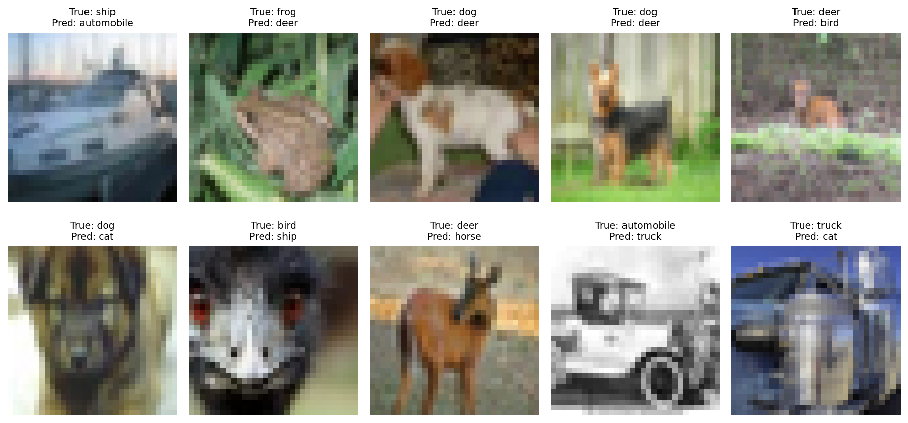
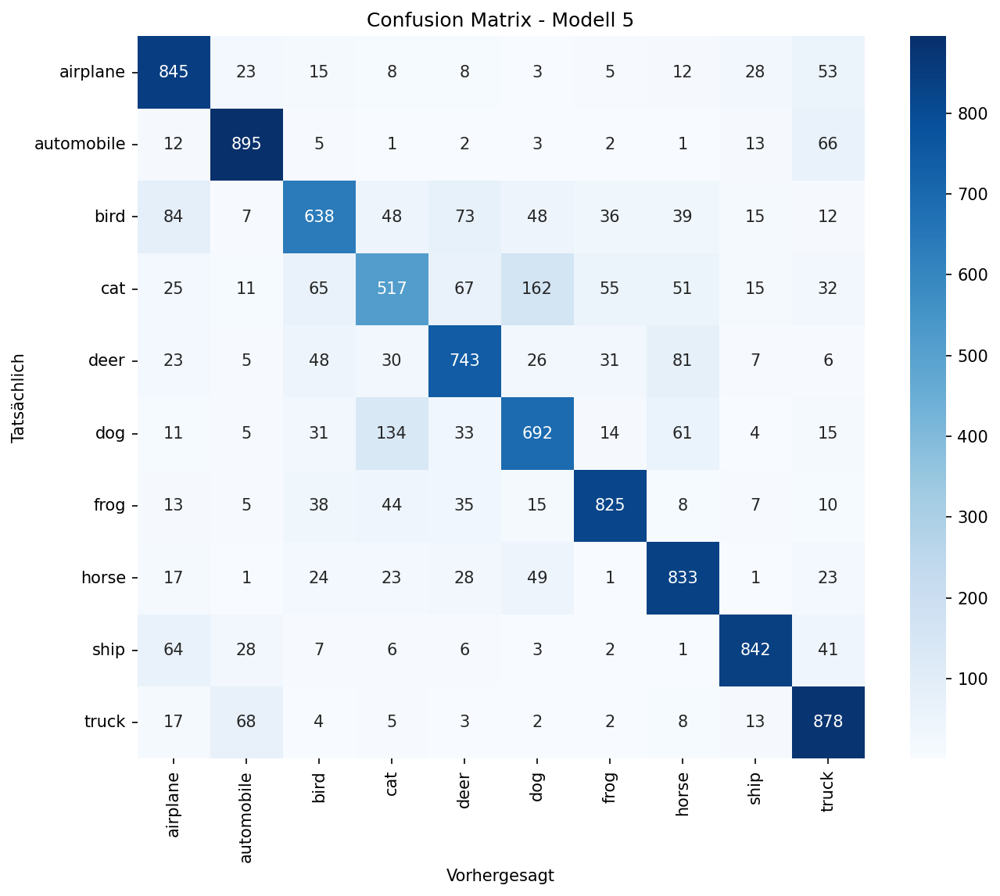

# CIFAR-10 Image Classification with CNN

3-day Deep Learning project — Ironhack AI Engineering Bootcamp (W3 D3-D5).

## About

A Convolutional Neural Network (CNN) that classifies 32×32 color images into
10 categories (airplane, automobile, bird, cat, deer, dog, frog, horse, ship,
truck). Built iteratively across 7 models, comparing data augmentation,
regularization, extended training, and transfer learning.

**Sample prediction:**


*(True vs. Predicted label for 10 test images — most errors are visually
reasonable, e.g. cat predicted as dog.)*

## Problem Statement

Image classification is a foundational computer vision task: given an image,
assign it to one of several predefined categories. This project builds a CNN
from scratch, evaluates it rigorously (accuracy, precision, recall, F1,
confusion matrix), and compares it against a transfer-learning baseline
(VGG16), to understand which modeling choices actually improve performance.

## Dataset

- **Source:** [CIFAR-10](https://www.cs.toronto.edu/~kriz/cifar.html), created by
  the University of Toronto (Krizhevsky, Hinton et al.)
- **Size:** 60,000 images total (50,000 train + 10,000 test)
- **Classes:** 10 balanced classes, 6,000 images each — airplane, automobile,
  bird, cat, deer, dog, frog, horse, ship, truck
- **Resolution:** 32×32 pixels, RGB
- **License:** Available for research/educational use; see the
  [official CIFAR-10 page](https://www.cs.toronto.edu/~kriz/cifar.html) for
  full terms
- **Access in this project:** loaded via `tensorflow.keras.datasets.cifar10`
  (no manual download needed)

## Model Architecture

Input (32×32×3)
→ Conv2D(32, 3×3) + ReLU → MaxPooling2D(2×2)
→ Conv2D(64, 3×3) + ReLU → MaxPooling2D(2×2)
→ Conv2D(64/128, 3×3) + ReLU
→ Flatten
→ Dense(64) + ReLU
→ Dense(10) + Softmax

Filter count increases with depth (32→64→128) while spatial resolution
shrinks after each pooling layer — early layers detect simple features
(edges, colors), deeper layers detect more abstract, class-specific patterns.
The best model (Model 5) additionally uses live data augmentation (rotation,
shift, horizontal flip) and is trained for 25 epochs with early stopping.

Transfer learning (Model 7) replaces this custom stack with a frozen,
ImageNet-pretrained VGG16 as feature extractor. Full details: [REPORT.md](./REPORT.md).

## Results

| Model | Key change | Val Accuracy | Test Accuracy |
|---|---|---|---|
| 1 | Baseline (3 conv layers) | 68.7% | 68.0% |
| 2 | More filters (32-64-128) | 71.1% | 70.6% |
| 3 | + Data Augmentation | 70.5% | 70.5% |
| 4 | + Dropout | 70.3% | — |
| **5** | **+ 25 epochs, Early Stopping** | **77.4%** | **77.1%** |
| 6 | Lower learning rate | 64.3%* | ~64% |
| 7 | Transfer Learning (VGG16) | 75.7% | 75.8% |

*\*Model 6: training interrupted by a technical (Colab) issue, not fully comparable.*

**Best model: Model 5** — 77.1% test accuracy, F1-scores ranging from 0.57
(cat, weakest) to 0.87 (automobile/ship, strongest).

**Confusion Matrix:**



Main confusion: **cat ↔ dog** (both furry, four-legged pets). Minimal
confusion between unrelated classes, indicating the model learned meaningful
visual patterns rather than memorizing training data. Full analysis:
[REPORT.md](./REPORT.md).

## Setup & Installation

```bash
git clone https://github.com/<your-username>/cifar10-image-classification.git
cd cifar10-image-classification
pip install -r requirements.txt
```

Open the notebooks in `notebooks/` using Google Colab (recommended, free GPU)
or Jupyter, and run cells in order:
1. `01_baseline_model.ipynb` — setup, data loading, preprocessing, Models 1-2
2. `02_augmentation_and_more_models.ipynb` — augmentation, Models 3-7, full evaluation

## Project Structure

notebooks/            → Jupyter/Colab notebooks
models/                → saved (pickled) trained models
REPORT.md              → full project report with results and analysis
PRESENTATION_OUTLINE.md / .pptx → presentation slides
confusion_matrix.png   → confusion matrix for best model
sample_errors.png      → misclassified test images (true vs. predicted)
requirements.txt       → dependencies

## Author

Skander — Ironhack AI Engineering Bootcamp
